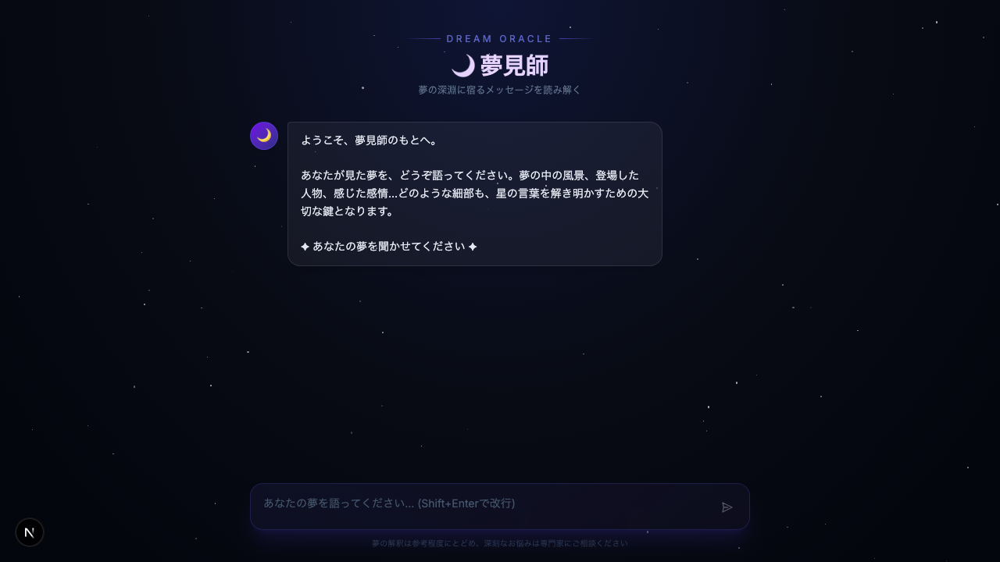
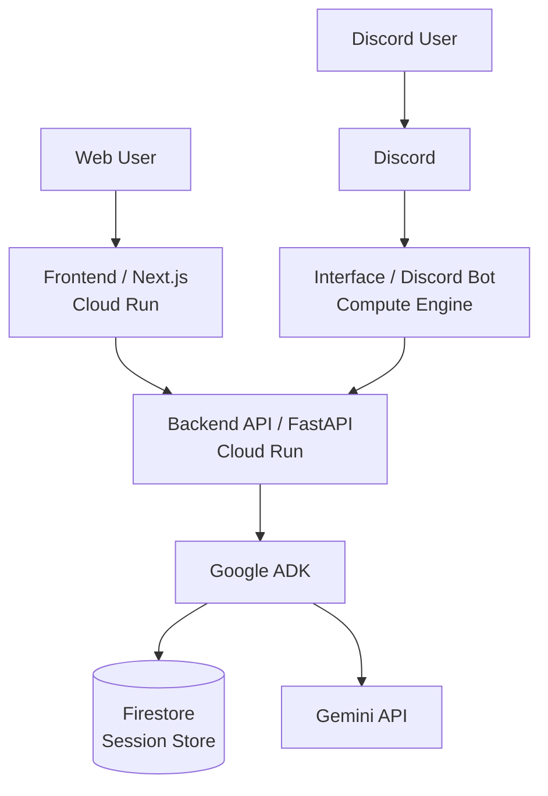

# 🎭 madamis-ai — マダミスサポート AI

マーダーミステリー（通称「マダミス」）の **ルール確認・用語・進め方・GM 向けの段取り** などを、チャットで相談できる AI アシスタントです。  
**商業シナリオの真相や犯人の開示は行わず**、卓の合意とシナリオ・GM の指示を優先するよう設計しています。



---

## 🏗 アーキテクチャ

役割ごとに次の 3 コンポーネントで構成しています。

- **Backend (FastAPI)**: Google ADK を用いたマダミスサポート用の推論 API。Cloud Run でホスト想定。
- **Firestore**: Cloud Run 上の ADK セッション履歴・状態を永続化。
- **Frontend (Next.js)**: ダークトーンの Web チャット UI。Cloud Run でホスト想定。
- **Interface (Discord Bot)**: Discord からも同じ API を利用。Compute Engine で常時稼働想定。



---

## ⚡ クイックスタート

### 1. 開発環境の準備

ツール管理に [mise](https://mise.jdx.dev/) を使用しています。

```bash
mise install
```

### 2. API キーの設定

**コンポーネントごとに `backend/.env` と `interface/.env` を置く**形にしています（ルートの `.env` は不要）。

```bash
cp backend/.env.example backend/.env
# backend/.env に GOOGLE_API_KEY（チャット API 用）を設定

cp interface/.env.example interface/.env
# Discord を Docker やローカルで動かすときだけ interface/.env に DISCORD_BOT_TOKEN を設定
```

`uv run` で backend / interface を単体起動するときも、各ディレクトリの `.env` が読み込まれます。ローカル backend は既定でメモリ上のセッションを使います。Firestore に保存したい場合は `backend/.env` に `ADK_SESSION_SERVICE=firestore`、`FIRESTORE_PROJECT_ID`、`FIRESTORE_DATABASE_ID` を設定し、ADC などの Google Cloud 認証を用意してください。

### 3. Docker Compose で起動

Compose は **`backend/.env` / `interface/.env`** を読み込みます（ファイルが無くても起動はしますが、キー未設定なら API や Bot は動きません）。

**Web + バックエンドのみ**（Discord なし）:

```bash
docker compose up --build
```

**Discord Bot も同時に起動**（`interface/.env` に `DISCORD_BOT_TOKEN` が必要）:

```bash
docker compose --profile discord up --build
```

- **Web UI**: http://localhost:3000
- **Backend API**: http://localhost:8000
- **Discord Bot**: `--profile discord` のときのみ起動。トークンが空だとコンテナは終了します。

---

## 🛠 開発・テスト

### バックエンド / インターフェース (Python)

パッケージ管理には [uv](https://docs.astral.sh/uv/) を使用しています。

各 Python ディレクトリで一度 `uv sync` してから実行してください。

```bash
# 型チェック（パッケージ単位・CI と同じ）
cd backend && uv run ty check madamis
cd interface && uv run ty check madamis_interface

# Lint (ruff)
cd backend && uv run ruff check .
cd interface && uv run ruff check .

# テスト（backend/tests, interface/tests）
cd backend && uv run pytest
cd interface && uv run pytest
```

### フロントエンド (Node.js)

```bash
cd frontend
npm install
npm run lint
npm test
```

---

## 🚀 GCP デプロイと CI

`terraform/` には GCP 用の定義（Cloud Run、Compute Engine、Secret Manager、Artifact Registry など）があります。  
**GitHub Actions による CD は現状未実装**です。本番では Docker ビルド・レジストリへのプッシュ・`terraform apply` を手動または別パイプラインで行う想定です。

### インフラ構成（Terraform 想定）

- **Cloud Run**: Backend API, Web Frontend
- **Firestore**: ADK セッション状態の永続化
- **Compute Engine (e2-micro)**: Discord Bot（Free Tier 活用想定）
- **Secret Manager**: API キー・トークン
- **Artifact Registry**: Docker イメージ

既定では Cloud Run / Artifact Registry / Firestore は日本リージョン（`asia-northeast1`）、Discord Bot 用 GCE は Free Tier 対象ゾーン（`us-west1-a`）に作成します。

### CI（GitHub Actions）

`main` へのプッシュおよび `main` 向け PR で [`.github/workflows/ci.yml`](.github/workflows/ci.yml) が動き、backend / interface / frontend で Lint・型チェック・テストを実行します。

---

## 📁 ディレクトリ構造

```
madamis-ai/
├── docs/             # README 用スクリーンショットなど
├── backend/          # FastAPI（`madamis/`・`tests/`・`.env.example` → `.env`）
├── frontend/         # Next.js Web UI
├── interface/        # Discord Bot（`madamis_interface/`・`tests/`・`.env.example` → `.env`）
├── terraform/        # GCP インフラ定義
├── .github/          # GitHub Actions（CI）
├── .mise.toml
└── compose.yaml
```

---

## 技術スタック

| 分類 | 技術 |
|---|---|
| AI エージェント | [google-adk](https://google.github.io/adk-docs/) |
| LLM | `gemini-3-flash-preview` |
| Web UI | Next.js (React 19), Tailwind CSS, Vitest |
| API | FastAPI, Uvicorn, Pytest |
| Infra | Terraform, GCP（Cloud Run, GCE）, Docker |
| Dev Tools | uv, mise, ruff, ty |

---

## 利用上の注意

- 本 AI は **公式の判定やシナリオの正解の代弁ではありません。** ルール解釈・演出は **GM とシナリオ本体** に従ってください。
- 深刻な対人トラブルや心身の不調については、専門家・第三者の支援を受けてください。
